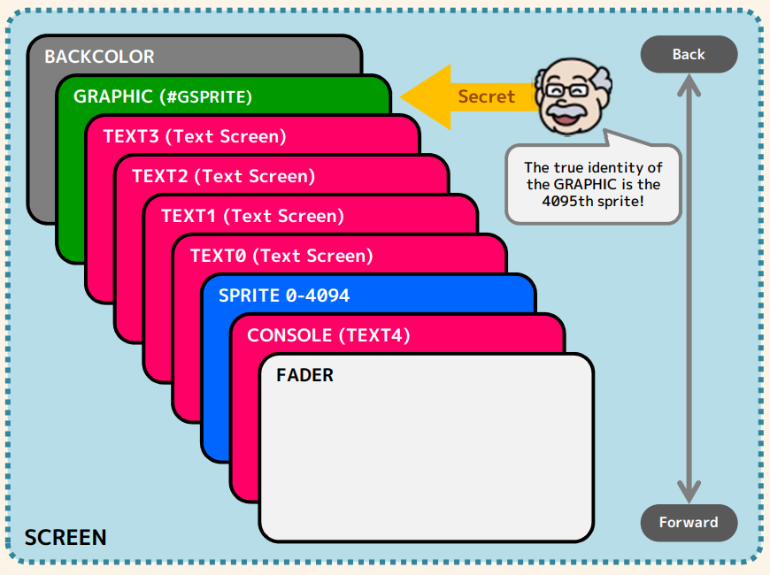
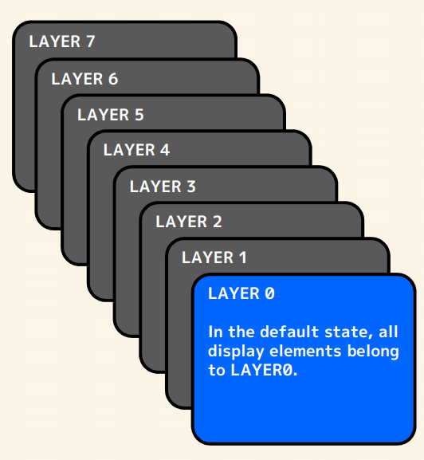

### Lenguaje especificacion, muy resumido

***

#### Palabras reservadas
~~~
01. IF             02. THEN              03. ELSE
04. ELSEIF         05. ENDIF             06. CASE
07. WHEN           08. OTHERWISE         09. ENDCASE
10. GOTO           11. GOSUB             12. RETURN
13. ON             14. LOOP              15. ENDLOOP
16. FOR            17. NEXT              18. WHILE
19. WEND           20. REPEAT            21. UNTIL
22. BREAK          23. CONTINUE          24. DEF
25. END            26. DEFOUT            27. VAR
28. DIM            29. AND               30. OR
31. XOR            32. NOT               33. DATA
34. READ           35. RESTORE           36. PRINT
37. TPRINT         38. INPUT             39. LINPUT
40. CALL           41. SWAP              42. OUT
43. COMMON         44. EXEC
~~~

#### MISC
~~~
@ <- para asignar label
# <- para asignar constante
~~~

#### Variable Scope
~~~
- variables local
- variables global
~~~

***

### Tipos de archivos

| tipo |  descripcion |
|--|--|
| TXT| Text Data |
| DAT| Numeric Data |
| GRP | Graphic Data |
| JPG | Graphic data (Lossy Compression) |

***

### Especificaciones de pantalla

La pantalla esta compuesta por los siguientes elementos

- Screen (Pantalla)
- Graphic Pages 
- Text Screen
- Sprites
- Layers

***

### Screen

~~~
ACLS
~~~
Borre todas las configuraciones de screen y vuelva al estado de inicio.

~~~
XSCREEN Width, Height
~~~
Asignar resolucion de pantalla.

**Width**: 128 a 1280

**Height**: 128 a 720

~~~
BACKCOLOR Color
~~~
Asignar color de fondo.

... ** Por documentar FADE **... Para efectos fade-in y fade-out.

***

 

fig. 1
***

### Text Screen

SmileBasic 4 tiene 5 text screen que van desde el 0 al 4.

El text screen 4 es una superficie de texto especial y se utiliza en el interprete de BASIC como salida de algunos comandos, como el PRINT e INPUT.

***

### Graphic Pages

Las **paginas de graficos** se utilizan para dibujar   y también como el almacenamiento de los recursos graficos, como lo son los **sprites** (por defecto **GRP4**) y las fuentes (**GRP5**) utilizadas en las text screen.

Hay 6 páginas gráficas. **GRP0** hasta la **GRP5**  y una especial **GRP-1**.

Las páginas gráficas tienen cada una un tamaño de **2048x2048** y pueden almacenar datos de píxeles con **ARGB8888**, que es de 1 píxel y 32 bits.

**GRP-1** es una página gráfica especial que no se puede escribir. Donde cualquier referencia devolvera un pixel blanco (**&HFFFFFFFF**).

**GRP5** es la página donde se almacena la fuente y se puede leer y escribir libremente, pero la visualización del texto se dañará si se reescribe el contenido de la página. **GRP5** también se denomina alias **GRPF**.

### Almacenamiento por defecto

| Recurso | Graphic Page | Cambiable? |
|--|--|--|
| fuente | GRP5 | NO |
| fuente definida por el usuario | GRP4(1024, 0) | TPAGE |
| sprite sheet | GRP4(0, 0) | SPPAGE |

#### Nota importante:

**GRP0** corresponde a la pantalla grafica (display screen), esto quiere decir que si dibujamos un gráfico o colocamos datos gráficos en GRP0, se mostrará en la pantalla.

**GRP1**, **GRP2** y **GRP3** por defecto estan sin uso y se pueden utilizar como buffer grafico, ya que esto no se mostraran en pantalla o como almacenamiento para mas sprites o fuentes.

***

~~~
TPAGE [ScreenID,] GraphicPage, ReferenceOriginX, ReferenceOriginY 
~~~
Donde **ScreenID** es un Text Screen [0 - 4], es opcional y su valor por defecto es 4.

~~~
SPPAGE GraphicPage
~~~
Asigna la pagine de graficos donde estan almacenados los sprites.

***

### Sprites

Lo primero a mencionar es que podemos tener un maximos de **4096 sprites en pantalla**, teniendo en cuenta que el ultimo sprite **#GSPRITE** (ID 4095) corresponde a **GRAPHIC** (donde se dibujan los graficos) en la fig.1.

***

#### Para instanciar un objeto sprite se utiliza la siguiente instruccion.
~~~
SPSET SpriteNumber, DefinitionNumber [,DisplayFlag]
~~~

- **SpriteNumber**, El identificador del sprite que se quiere instanciar. maximo 4095.
- **DefinitionNumber**, El identificador del grafico que se quiere asignar. (ver SMSMILE.PRG).
- **DisplayFlag**, por defecto es 1, si queremos que se dibuje en pantalla al ser creado.

~~~
SPCLR SpriteNumber
~~~
Elimina una instancia del objeto sprite. Es posible eliminar **#GSPRITE**, para luego instanciarlo de nuevo y trabajarlo como un sprite mas en pantalla si no requerimos en nuestro proyecto utilizar **GRAPHIC**.

~~~
SPSHOW SpriteNumber
~~~
Muestra el sprite, require ser instanciado previamente.

~~~
SPHIDE SpriteNumber
~~~
Oculta un sprite, requiere ser instanciado previamente.

#### Un objeto sprite tiene los siguientes atributos

~~~
- Referencia a la pagina de grafico.
- Referencia a su coordenada UV.
- UV Rotacion.
- UV Flip vertical.
- UV Flip horizontal.
- Color.
- Blend Method (Usually Addition).
- Posicion en pantalla.
- Z (-4095 a 4095).
- Home Position.
- Rotation (Arbitrary Angle).
- Ampliacion.
~~~

***

#### Los objetos sprite permiten asignarles variables locales

~~~
SPVAR SpriteNumber, VariableKey, Value
~~~
Asigna una variable local al objeto sprite.

~~~
SPVAR(SpriteNumber, VariableKey)
~~~
Retorna el valor de la variable.

**NOTA**: Estas variables son borradas cuando se utiliza **SPSET** o **SPCLR** para la instancia con los datos.

***

#### Por defecto se dibuajan en el siguiente orden:

~~~
      sprite 4095   <- Este es el sprite para graficos.
      sprite 4094
      sprite 4093
      .
      .
      .
      sprite    2
      sprite    1
      sprite    0
[     PANTALLA     ]
~~~

***

#### Sprite, Cambiar el orden de dibujado en pantalla y su posicion

~~~
SPOFS SpriteNumber, [X], [Y] [,Z]
~~~ 

Donde **Z** es opcional y va desde (-4095 a 4095), donde entre menor sea el numero mas cerca de la pantalla esta.

Por defecto **Z** es 0, cuando no se asigna.

~~~
SPOFS SpriteNumber [,CoordinateSystemFlag] OUT X, Y [,Z]
~~~
Retorna la posición del objeto sprite.

***

### SBSMILE.PRG

Visor de recursos:
 
 - BEEP
 - BGM
 - MML
 - DRUMSET
 - VIBRATE
 - SPDEF (DEFINICION DE SPRITES).
 - USERCHR

***

### Layers
La mas proxima a la pantalla es la capa 0.

 

fig.2

~~~
TLAYER ScreenID, LayerID
~~~
Establecer la capa a la que pertenece el text screen.

~~~
TLAYER(ScreenID)
~~~
Devuelve la capa que pertenece a la que pertenece el text screen.

~~~
SPLAYER SpriteNumber, LayerID
~~~
Establecer la capa a la que pertenece el sprite especificado.

~~~
SPLAYER LayerID
~~~
Establecer la capa a la que pertenece el sprite que se creará.

~~~
SPLAYER(SpriteNumber)
~~~
Devuelve la capa que pertenece a la que pertenece el sprite.

***

### MISC Instrucciones

**OUT**  Instrucción utilizada cuando se requieren múltiples salidas. Usado cuando se definen funciones y algunas instrucciones built-in.
